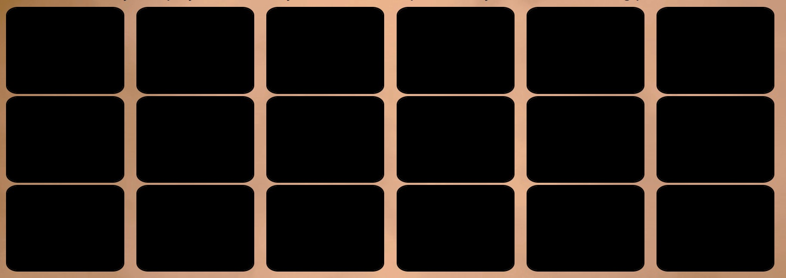
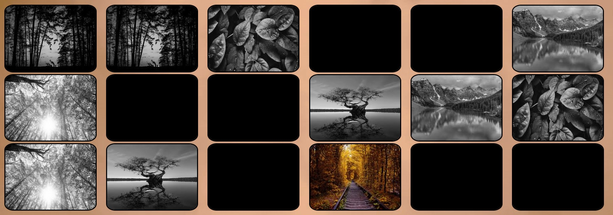
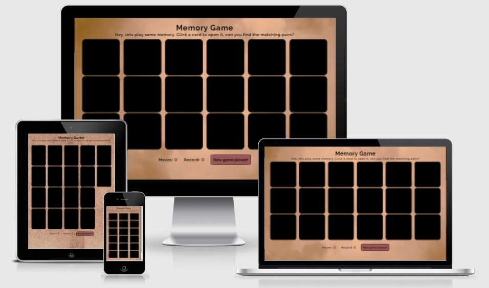

# Memory game

- Memory game is a site that provides a challenging and fun game for the user. The game will awaken your competitive instinct, entertain you, challenge you and give you some nice images to look at.

## Wireframe

- My first idea of design layout:

## Features

### Header

- Gives the user information about what kind of game this is and what the goal is.

### Game area

- The user is provided with 20 black squares that are supposed to play the role as playingcards turned upside down. The images that is hiding "behind" the cards are of 10 different images where every image has an identical twin, that the user i supposed to find. When the user hovers over a card it will react with getting a little bigger. This gives the user direct information about the possibility to click the cards.

- When you click a card it will show you an image in color, then the user is expected to click another one. When two cards are shown it will stay colored for a while, if they are the same image they will get a grayscale filter and stay opened. If they dont match they will turn black again.
It is not possible to click a card that is already turned and its also not possible to click any card when there are two cards turned. After the cards turned back to black or got a grayscale filter, the game continues.

### Score area

- At the bottom of the page the scores will be provided. Every time the user has turned 2 cards it will count as a "move". The amount of moves you have made will be shown as "moves" and when you finish the game the "record" will show you the lowest amount of moves you have made to finish the game, since the page loaded.

### Popup winning message

- When the user found every pair and managed to turn all the cards, a popup message will apear. The message will give a compliment to the user and provide information about how many moves the managed to win the game with. 
Here there will be possible to click a button to go back to the game with a new game area with images in another order. As with the cards, the button will react when hoverd over to show the user that it is clickable.

- If the amount of moves are less then the current record, the user will be provided with inormation about the new achieve record.

### Aditional ideas of extra features

- Make the play again button bigger on mobile phone screensizes so it is easier to click with the thumb
- Change the amount of cards depending on screensize so the roaws and columns always are similar in length. This gives a nicer design layout.
- A retry button underneath the score area to give the user a possibility to start over in the middle of a game.
- A little longer time to show the colored cards before they turn back, to make it easier for the user to remember the images.
- A description in the header on how to play technically instead of assuming the user will figure it out.

## Testing

### Mockup

- The site is tested on different screensizes and works well almost everytime without a scrollbar

### Lighthouse

- The site gets really good grades on the lighthouse scan.
Comments to get better grade:
  - Document does not have a meta description
  - Displays images with incorrect aspect ratio (I am guessing this is because the border of the images, wich I think only gives a nicer look)

### Validator testing

- HTML
  - No errors were returned when passing through the official <a href="https://validator.w3.org/nu/?doc=https%3A%2F%2Fjessicarydberg.github.io%2FMemoryGame%2F" target="_blank">W3C validator</a>
- CSS
  - No errors were found when passing through the official <a href="https://jigsaw.w3.org/css-validator/validator?uri=https%3A%2F%2Fjessicarydberg.github.io%2FMemoryGame%2F&profile=css3svg&usermedium=all&warning=1&vextwarning=&lang=en" target="_blank">(Jigsaw) validator</a>
- Javascript
  - No errors were found when passing through the official <a href="https://jshint.com/" target="_blank">Jshint validator</a>
  - The following metrics was returned:
    - There are 11 functions in this file.
    - Function with the largest signature take 2 arguments, while the median is 0.
    - Largest function has 31 statements in it, while the median is 3.
    - The most complex function has a cyclomatic complexity value of 7 while the median is 1.

### Fixed bugs

 - When clicking the "play again" button it is supposed to first remove all cards from the game area and then add 20 new ones in a shuffled order. 
   - I made a for loop with the expectation that it would add the remove() method to all the cards. I made an HTML collection with all the cards and added the remove() method to all of them targeting them with index = i at the end of the variable. What happend is that only 10 out of 20 cards was removed.
     - I realised after a while that the length of the HTML collection of images got shorter everytime one object was removed wich only added the remove() mehod to every other image and only removing half of them.
     - I solved the issue creating a while loop that loop while the HTML collections length was more then 0 and removing every object targetet with index= 0
 - I needed to remove the eventlistener to every card that was turned and shown, to make it unclickable, but I couldnt get it to work wich gave the user possibility to click one card two times and in that way "find the pair" because you clicked two images with the same source.
   - The console told me that it couldnt read "removeEventListener". I realised that the function the eventlistener was gonna provide was not in reach for both the add and remove listener method.
     - I solved it by putting the function as a value to a variable and then declairing this variable to the global scope.
 - When the user was really fast and clicked three cards before the two first cards turned back och grayscale, all three cards turned. After this the eventlisteners didnt really work as expected on some cards and some cards didnt turn the right way as expected.
   - I solved it by removing all eventlisteners directly after two cards was turned. This made all other cards unclickable during the time the two cards was shown.

### Unfixed bugs

 - The text on "Play again!" button seems to turn out blue on some screens. I think this happens only on iphones but I am not sure yet.

## Deployment

 - The site was deployed to GitHub pages. The steps to deploy are as follows:
   - A local git was used by first initialising with command git init.
   - Then at regular intervals i used command git add filename to add the various files into it.
   - Then i committed to local repo with command git commit -m "useful string info"
   - Then finally uploaded it to my GitHub repo with git push
     - When everything was done I navigated to the Settings tab in the GitHub repository, scrolled down to "GitHub Pages" section and clicked "Check it out here!" link.
Once the master branch has been selected, the page will be automatically refreshed with a detailed ribbon display to indicate the successful deployment.
The live link can be found here: https://jessicarydberg.github.io/MemoryGame/

## Credits

### Code

 - Took some inspiration on how to think while making a memory game at <a href="https://www.better.dev/build-a-memory-matching-game-in-javascript" target="_blank">Better dev</a>

### Design

 - Used <a href="https://imagecolorpicker.com/" target="_blank">Imagecolorpicker</a> to pick colors from the background images and use for the rest of the page.
 - Got my link for styling my fonts from <a href="https://fonts.google.com/" target="_blank">Google fonts</a>.

### Images

 - Got my image for the favicon from <a href="https://www.iconsdb.com/maroon-icons/micro-sd-icon.html" target="_blank">Iconsdb</a>.
 - I converted my png file (image for favicon) to a ico file using this <a href="https://favicon.io/" target="_blank">Favicon generator</a>.
 - Got all images for the playing cards at <a href="https://unsplash.com/" target="_blank">Unsplash</a>
 - Made my mockup at <a href="http://ami.responsivedesign.is/" target="_blank">Ami responsive design</a>
 - Used <a href="https://www.reduceimages.com/?gclid=CjwKCAiAgbiQBhAHEiwAuQ6BkjPcHdKgXFydjxwbJlulKrBysn4VcY1yxKLqQ-wAOrMoAlnrJ6zqxRoCkccQAvD_BwE" target="_blank">Reduce images</a> to make my images a bit smaller. This made the page load much faster.